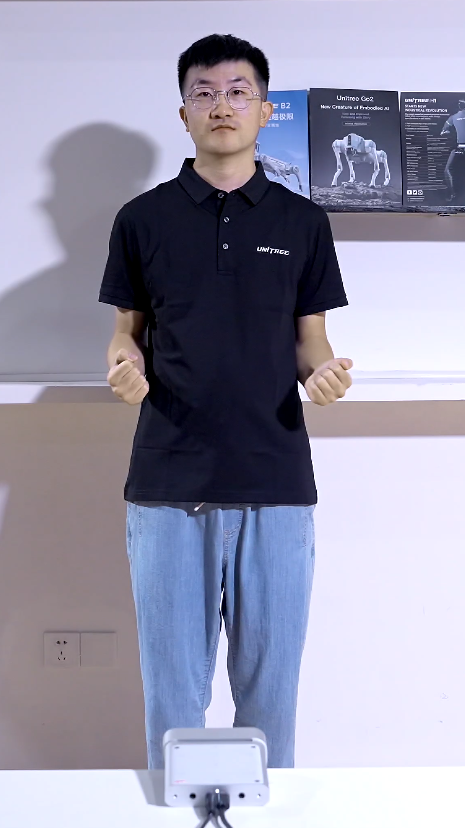

# kinect_teleoperate

This branch provides an installation script that should work with ORBTEC Femto Bolt + Ubuntu 22.04 system

## Install
`./install_orbtec_k4a.bash`

## Run
Make sure you're in main folder and run `./build/kinect_teleoperate`

### Activation
Follow this guy's pose

 { width=50% }

### Key Shortcuts
- ESC: quit
- h: help
- b: body visualization mode
- k: 3d window layout
- s: start

NOTE: You must have a cursor focus on `camera view` to press key

### Note
1. Known working nvidia driver version is 570
2. Known working kernel is 6.8.0-60-generic
3. To switch version, press SHIFT during boot
4. In best case, k4aviewer works
