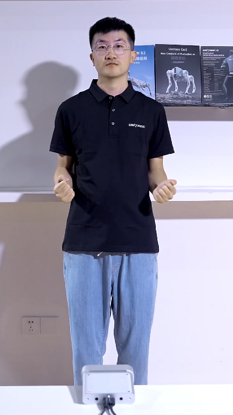

# kinect_teleoperate

This branch provides an installation script that should work with ORBTEC Femto Bolt + Ubuntu 22.04 system

## Install
`./install_orbtec_k4a.bash`

## Run
Make sure you're in main folder and run `./build/kinect_teleoperate`

### Activation
Follow this guy's pose
 

### Key Shortcuts
ESC: quit
h: help
b: body visualization mode
k: 3d window layout

NOTE: You must have a cursor focus on `camera view` to press key
